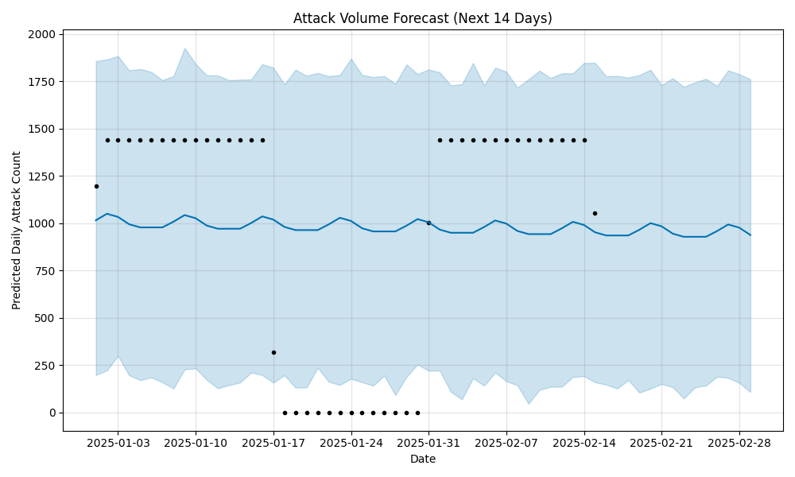
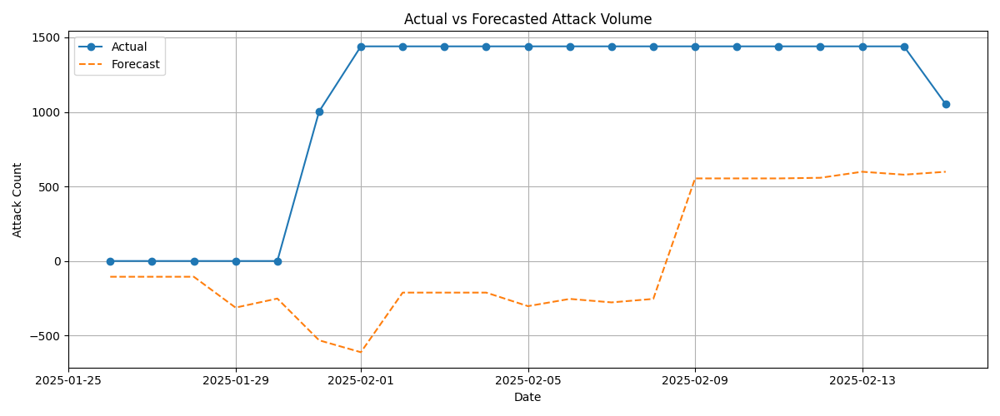
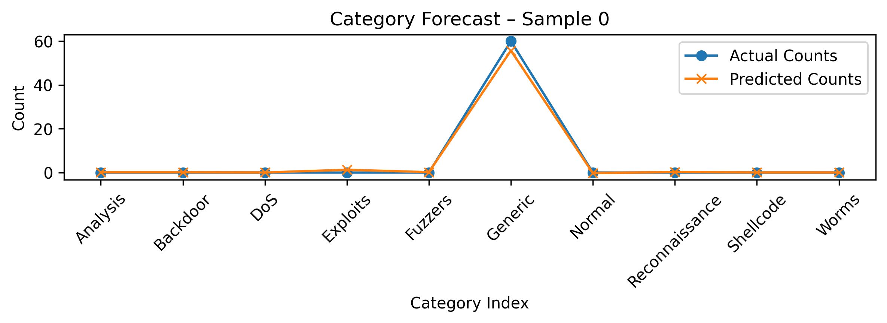
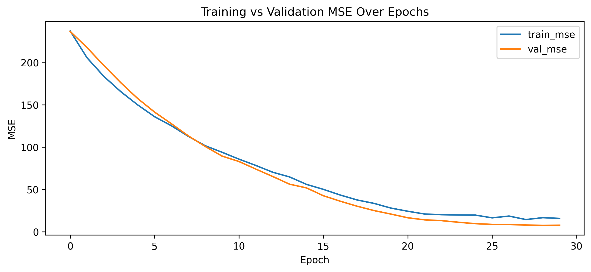
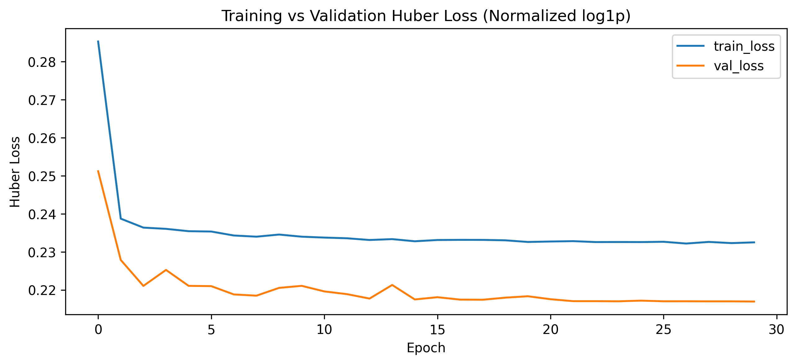
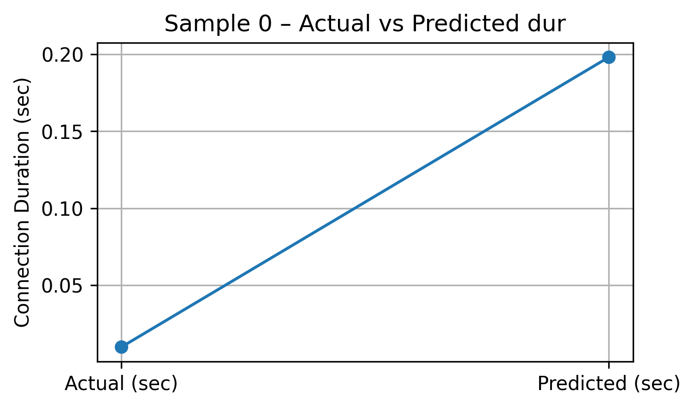

# RogueShield: AI-Powered Threat Detection & Forecasting

RogueShield is an AI-powered threat detection and attack forecasting system built using TensorFlow, Streamlit, and SHAP. It classifies network intrusions in real-time, forecasts future attack patterns, and maps results to the MITRE ATT&CK framework — making it a powerful tool for cybersecurity automation and intelligence.

---

## Features

-  Multiclass intrusion detection using deep learning
-  Forecasts both attack *categories* and *time-to-next* using LSTM/GRU models
-  Model explainability via SHAP
-  MITRE ATT&CK tactic & technique mapping
-  Real-time dashboard built with Streamlit

---

##  Tech Stack

- **Machine Learning**: TensorFlow, Scikit-learn
- **Explainability**: SHAP
- **Frontend**: Streamlit
- **Backend**: Flask (optional REST API)
- **Data**: [UNSW-NB15 Dataset](https://www.unsw.adfa.edu.au/unsw-canberra-cyber/cybersecurity/ADFA-NB15-Datasets/)


---

## Project Structure

```
rogueshield-ai-threat-detector/
├── data/                    # Raw dataset CSVs
├── notebooks/
│   ├── eda_unsw_nb15.ipynb
│   ├── forecasting/
│   │   ├── attack_volume/forecast.png
│   │   ├── attack_volume_forecast.ipynb
│   │   └── attack_category_forecast.ipynb
├── models/                           # Saved TensorFlow models
├   ├── intrusion_classifier/         # DNN intrusion detection model
│   ├── category_forecast/            # LSTM model for attack category trends
│   ├── time_to_next_dur_gru/         # GRU model for attack timing                  # Saved TensorFlow models
├── explainability/          # SHAP, MITRE mappings
├── app/                     # Streamlit/Flask app (upcoming)
├── requirements.txt
├── README.md
├── LICENSE

```

---

##  Quick Start

```bash
git clone https://github.com/YOUR_USERNAME/rogueshield-ai-threat-detector.git
cd rogueshield-ai-threat-detector
pip install -r requirements.txt

# Launch the Streamlit app
streamlit run app/app.py
```

---

## Attack Volume Forecasting

This module uses time-series forecasting to analyze and predict the volume of cyberattacks over time from the UNSW-NB15 dataset. This helps SOC teams forecast potential spikes in attack traffic for proactive mitigation.

### Objective
- Predict future attack volumes (14-day horizon)
- Identify temporal patterns and seasonal behaviors in attack frequencies

### Tools & Methods
- Facebook Prophet (additive time-series model)
- Pandas, Plotly, Matplotlib

### Results
- **Trend:** Slightly decreasing trend over the forecast horizon
- **Weekly Pattern:** Highest attack activity observed on **Thursdays**
- **Forecast Confidence Interval:** 95%
- **Forecast Accuracy Visuals** RMSE and MAE plots show how forecast error varies over time horizons. Actual vs. forecast overlay indicates consistent prediction performance over observed periods.

### Output





[View Forecast Notebook](notebooks/forecasting/attack_volume_forecast.ipynb)
[View EDA Notebook](notebooks/eda_unsw_nb15.ipynb)


---

## Attack Category Trend Forecasting

This module predicts future distributions of cyberattack categories (e.g., DoS, Exploits, Reconnaissance) using LSTM networks.

### Objective
- Forecast category-wise attack prevalence one hour into the future
- Enable preemptive threat hunting and resource allocation

### Tools & Methods
- LSTM (TensorFlow)
- One-hot encoding, time-based aggregation
- Model Evaluation via MAE, Visualizations

### Output





[View Category Forecast Notebook](notebooks/forecasting/attack_category_forecast.ipynb)

---

## Time-to-Next-Attack Forecasting

This module predicts the **time until the next attack** using GRU-based regression, allowing systems to anticipate downtime or overload risk.

### Objective
- Learn temporal gaps between events using `dur` values
- Forecast time-to-next attack using log-normalized inputs

### Tools & Methods
- GRU (TensorFlow)
- Log Transformation, Min-Max Scaling
- Huber Loss for robust regression

### Output




[View Duration Forecast Notebook](notebooks/forecasting/time_to_next_dur.ipynb)


## License

This project is licensed under the MIT License – see the [LICENSE](LICENSE) file for details.

---

## Contact

For questions or collaboration:  
**Mahasweta Roy**  
[LinkedIn](https://www.linkedin.com/in/mahasweta-roy-9b79b6150/) | [Email](mailto:mahaswetaroy123@gmail.com)

---


