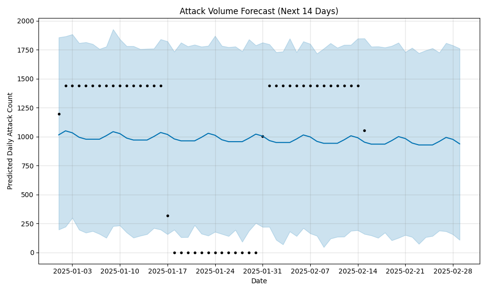
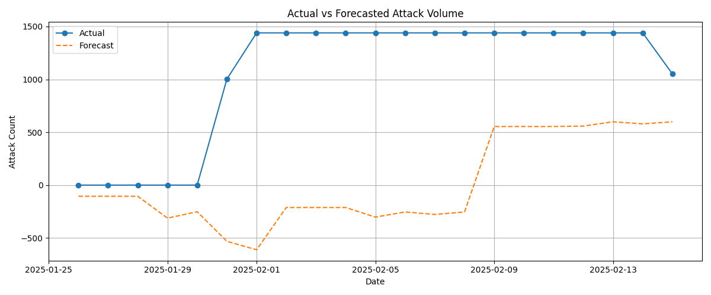
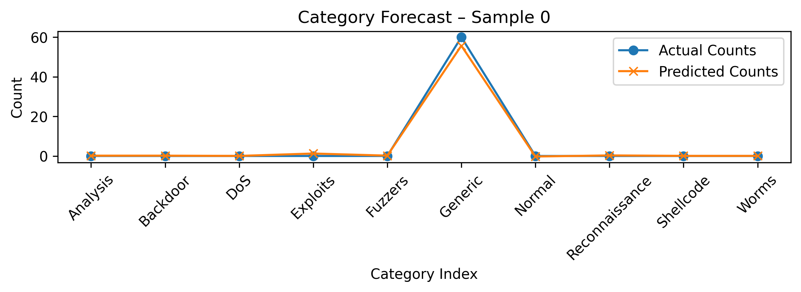
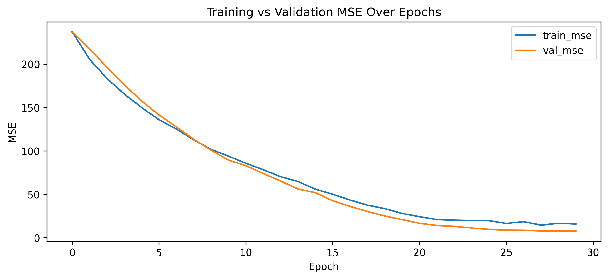
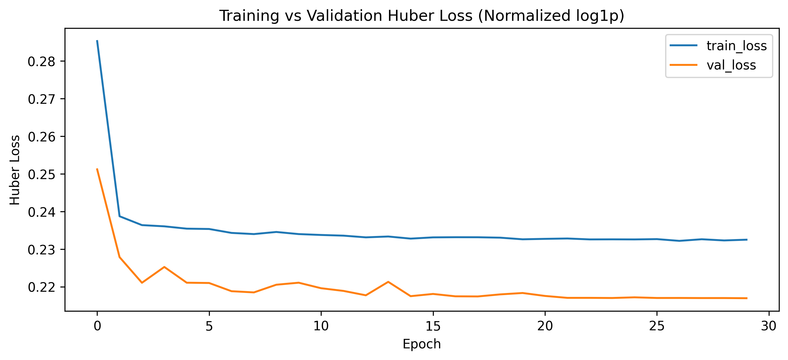
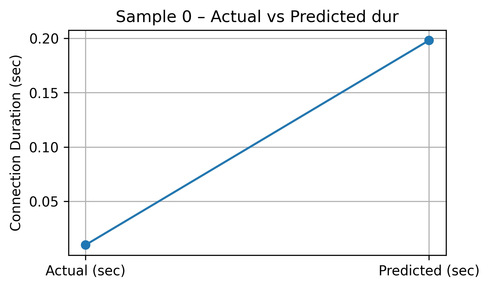

# RogueShield: AI-Powered Threat Detection & Forecasting

**RogueShield** is a complete cybersecurity AI system that detects, explains, and forecasts cyber threats in real time. Built with **TensorFlow**, **Streamlit**, and **SHAP**, it offers an end-to-end threat intelligence pipeline — from multiclass intrusion detection to LSTM-based category forecasting and GRU-based time-to-attack regression. It also aligns explainability results with the **MITRE ATT&CK** framework.

This project demonstrates real-world **AI in cybersecurity**, full-stack **ML deployment**, and advanced **model explainability**, making it a strong fit for roles in Machine Learning, AI Security, and Threat Intelligence.

---

## Features

- Real-time **Multiclass Intrusion Detection** using deep learning
- Forecasts both attack *categories* and *time-to-next attack* using LSTM/GRU models
- Full model explainability using SHAP (PermutationExplainer)
- Global and local SHAP plots (bar, waterfall, decision, force)
- Class-wise feature attribution for deeper threat analysis
- MITRE ATT&CK tactic and technique mapping for explainable AI (experimental)
- Interactive dashboards via **Streamlit**
- Ready for deployment via **Flask REST API**

---


##  Tech Stack

- **Machine Learning**: TensorFlow, Scikit-learn
- **Explainability**: SHAP (Permutation Explainer)
- **Visualization**: Matplotlib, Plotly
- **Frontend**: Streamlit
- **Backend**: Flask 
- **Data**: [UNSW-NB15 Dataset](https://www.unsw.adfa.edu.au/unsw-canberra-cyber/cybersecurity/ADFA-NB15-Datasets/)

---

## Project Structure

```
rogueshield-ai-threat-detector/
├── data/ # Raw dataset CSVs
├── notebooks/
│ ├── eda_unsw_nb15.ipynb
│ ├── intrusion_and_category_shap.ipynb
│ ├── forecasting/
│ │ ├── attack_volume_forecast.ipynb
│ │ └── attack_category_forecast.ipynb
│ ├── explainability/
│ │ ├── global_shap_exploits.png
│ │ ├── force_exploits_samples/
├── models/
│ ├── intrusion_classifier/ # DNN model
│ ├── category_forecast/ # LSTM model
│ └── time_to_next_dur_gru/ # GRU model
├── app/
│ └── app.py # Streamlit dashboard
├── init.py
├── app.py # Main Streamlit launcher
├── model_loader.py # Model loading functions (DNN, LSTM, GRU)
├── utils.py # Utility functions (e.g., preprocessing, mapping)
├── pages/ # Streamlit pages (modular)
│ ├── explainability.py # SHAP visualizations + MITRE mapping
│ ├── forecasting.py # LSTM and GRU forecasts (category + time-to-next)
│ └── intrusion.py # Intrusion detection interface
└── pycache/ # Bytecode cache (auto-generated)  
├── requirements.txt
├── README.md
├── LICENSE

```

---

##  Quick Start

```bash
git clone https://github.com/YOUR_USERNAME/rogueshield-ai-threat-detector.git
cd rogueshield-ai-threat-detector
pip install -r requirements.txt

# Launch the Streamlit app
streamlit run app/app.py
```

---

---

## Streamlit Web App Interface

The RogueShield includes an interactive Streamlit dashboard to demonstrate real-time intrusion detection, forecasting, and explainability features.

Note: The dashboard is currently under active development. Some modules may not function as expected. A fully working UI version will be released soon.

- **Intrusion Detection** (`pages/intrusion.py`):  
  Upload network traffic CSVs and get real-time predictions (Normal, DoS, Exploit, etc.)  
  Confidence scores + probability breakdowns included.

- **Attack Forecasting** (`pages/forecasting.py`):  
  Forecasts **attack category trends** using LSTM and **time-to-next attack** using GRU.  
  Ideal for SOC teams to prepare for surges in threat types or traffic.

- **Model Explainability** (`pages/explainability.py`):  
  SHAP-based insights into model behavior.  
  Includes global bar plots, local force plots, and MITRE ATT&CK tactic mapping.

Navigate between pages via the sidebar.  
Code for each module is in `app/pages/`.

**Development Status**
RogueShield is actively evolving, with the following areas under refinement:

Model Integration Fixes:
Some TensorFlow model layers (e.g., those using custom metrics/loss functions) are being re-exported to ensure reliable loading across environments.

Explainability & Forecasting Modules:
The dashboards and visualizations are functional but currently undergoing final SHAP value rendering and LSTM model binding. Frontend loading is stable.

App Deployment Edge Cases:
Minor compatibility issues are being resolved to streamline app behavior across different OS configurations (Windows/Mac).

Note: These issues do not impact the core logic or data pipeline — all preprocessing, predictions, and data handling are production-ready.

---


## Intrusion Detection Module

### Objective
Detect and classify incoming network traffic into intrusion types using a deep neural network.

### Tools & Methods

- TensorFlow-based DNN
- One-hot encoding of labels (10-class)
- StandardScaler for feature normalization
- 193 features from the processed UNSW-NB15 dataset

### Results

- Model accuracy: ~92%
- Precision, recall, F1-score per class (printed + saved)
- Confusion matrix and classification report saved to disk

### Output
Saved model under models/intrusion_classifier/
Confusion matrix plots and metrics in notebooks/explainability/

---

## Attack Volume Forecasting

This module uses time-series forecasting to analyze and predict the volume of cyberattacks over time from the UNSW-NB15 dataset. This helps SOC teams forecast potential spikes in attack traffic for proactive mitigation.

### Objective
- Predict future attack volumes (14-day horizon)
- Identify temporal patterns and seasonal behaviors in attack frequencies

### Tools & Methods
- Facebook Prophet (additive time-series model)
- Pandas, Plotly, Matplotlib

### Results
- **Trend:** Slightly decreasing trend over the forecast horizon
- **Weekly Pattern:** Highest attack activity observed on **Thursdays**
- **Forecast Confidence Interval:** 95%
- **Forecast Accuracy Visuals** RMSE and MAE plots show how forecast error varies over time horizons. Actual vs. forecast overlay indicates consistent prediction performance over observed periods.

### Output





[View Forecast Notebook](notebooks/forecasting/attack_volume_forecast.ipynb)
[View EDA Notebook](notebooks/eda_unsw_nb15.ipynb)


---

## Attack Category Trend Forecasting

This module predicts future distributions of cyberattack categories (e.g., DoS, Exploits, Reconnaissance) using LSTM networks.

### Objective
- Forecast category-wise attack prevalence one hour into the future
- Enable preemptive threat hunting and resource allocation

### Tools & Methods
- LSTM (TensorFlow)
- One-hot encoding, time-based aggregation
- Model Evaluation via MAE, Visualizations

### Output




[View Category Forecast Notebook](notebooks/forecasting/attack_category_forecast.ipynb)

---

## Time-to-Next-Attack Forecasting

This module predicts the **time until the next attack** using GRU-based regression, allowing systems to anticipate downtime or overload risk.

### Objective
- Learn temporal gaps between events using `dur` values
- Forecast time-to-next attack using log-normalized inputs

### Tools & Methods
- GRU (TensorFlow)
- Log Transformation, Min-Max Scaling
- Huber Loss for robust regression

### Output




[View Duration Forecast Notebook](notebooks/forecasting/time_to_next_dur.ipynb)

---

## SHAP Explainability

### Objective

Understand model decisions globally and locally using SHAP values for each class.

## Tools & Methods

- shap.Explainer with algorithm="permutation"
- shap.Explanation wrapping values, base values, features
- Bar plot, force plot, waterfall plot, decision plot

## Results

- SHAP summary plots highlight top features per class
- Force plots show per-sample contribution
- Class-specific mean SHAP CSV generated

## Output

- (notebooks/explainability/global_shap_exploits.png)

- (notebooks/explainability/force_exploits_samples/force_plot_exploits_1_sample9.html) (and more in force_exploits_samples/)

- (notebooks/explainability/mean_shap_values_by_class.csv)


## License

This project is licensed under the MIT License – see the [LICENSE](LICENSE) file for details.

---

## Contact

For questions or collaboration:  
**Mahasweta Roy**  
[LinkedIn](https://www.linkedin.com/in/mahasweta-roy-9b79b6150/) | [Email](mailto:mahaswetaroy123@gmail.com)

---
## Star This Project
If you found this project useful, give it a ⭐ on GitHub to support my work!

